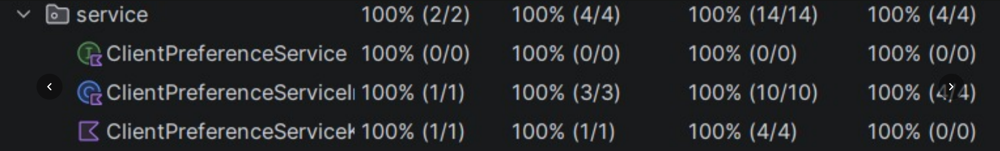
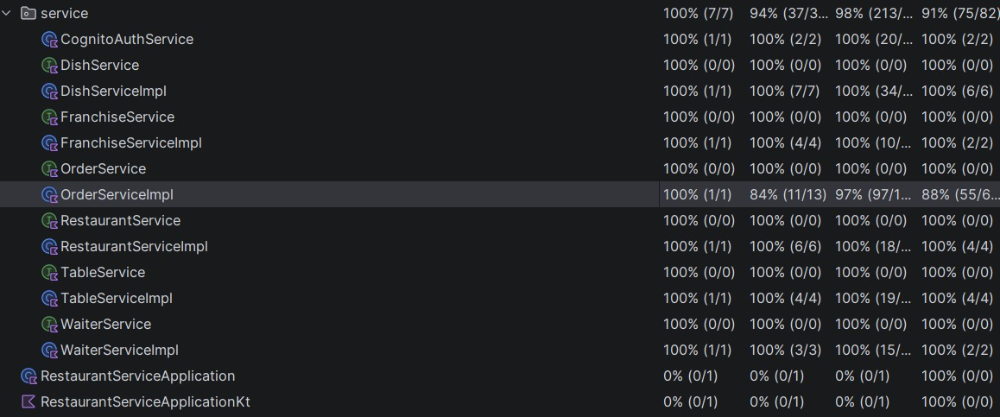

# [Deyvi Jhoan Alvarez Villagomez, Jeremy Joshua Arevalo Cango] — NRC [1462] — Proyecto Integrador

**Nombre del proyecto:** RestoLink

**URL desplegada:** `http://localhost:80` (reverso Nginx expone `80:80`)

---

## 1. Resumen del proyecto

Este monorepo contiene los siguientes componentes:

- `backend/`: microservicio principal `restaurant-service`.
- `client-preferences-service/`: microservicio secundario de preferencias del cliente.
- `nginx/`: reverse proxy que expone únicamente el puerto `80` hacia el host.
- `docker-compose.yml`: orquesta los dos microservicios, las dos bases de datos PostgreSQL, y nginx.
- `postman_collection.json`: colección de Postman para los flujos de la aplicación.
- `proyecto_integrador.postman_environment.json`: environment de Postman para variables de entorno.

---

## 2. Cómo arrancar el sistema

1. Copiar el archivo de variables de entorno:

```bash
cp .env.example .env
```

2. Ajustar valores sensibles en `.env` si es necesario.

3. Ejecutar Docker Compose:

```bash
docker compose up --build -d
```

4. Verificar que los contenedores estén `healthy`:

```bash
docker compose ps
```

5. Abrir el servicio a través de Nginx en el host:

```text
http://localhost:80
```

---

## 3. Diagrama de arquitectura

```text
                  +----------------+
                  |     NGINX      |
                  |  (80:80 host)  |
                  +--------+-------+
                           |
             +-------------+--------------+
             |                            |
+---------------------+        +---------------------------+
| restaurant-service  |        | client-preferences-service|
| (8080 internal)     |        | (8082 internal)           |
+----------+----------+        +------------+--------------+
           |                               |
   +-------+--------+             +--------+-------+
   | restaurant-db  |             | client-preferences-db |
   | postgres:16-alpine |         | postgres:16-alpine    |
   +-----------------+             +---------------------+
```

### Notas de la arquitectura

- Solo `nginx` expone un puerto al host (`80:80`).
- Los microservicios y las bases usan `expose:` y permanecen en la red interna de Compose.
- El descubrimiento ocurre por nombre de servicio Docker: `http://client-preferences-service:8082`, `http://restaurant-service:8080`.
- Cada microservicio tiene su propia base de datos PostgreSQL separada.
- Nginx monta la configuración como volumen de solo lectura: `nginx/nginx.conf` y `nginx/proxy_headers.conf`.

---

## 4. Reglas de `docker-compose.yml` cumplidas

- `nginx` es el único servicio con `ports:` expuesto al host.
- Los microservicios y las bases de datos utilizan `expose:`.
- Se usa `postgres:16-alpine` en ambas bases de datos, nunca `latest`.
- Cada base tiene un `healthcheck` con `pg_isready -U <user> -d <db>`.
- Cada microservicio depende de su propia base con `condition: service_healthy`.
- La dependencia entre microservicios usa `condition: service_started`.
- Los volúmenes de base son nombrados (`restaurant_data`, `client_preferences_data`).
- La configuración de Cognito se inyecta mediante variables de entorno definidas en `.env`.

---

## 5. Configuración de Cognito

Las variables de Cognito se documentan y configuran en `.env` y `.env.example`:

- `COGNITO_USER_POOL_ID=us-east-1_dVFfTH2gg`
- `COGNITO_APP_CLIENT_ID=5447p84r72dpda0ifsp6vgqb7j`
- `COGNITO_DOMAIN_BASE=https://us-east-1dvffth2gg.auth.us-east-1.amazoncognito.com`
- `COGNITO_REDIRECT_URI=miapp://callback`
- `COGNITO_ISSUER_URI=https://cognito-idp.us-east-1.amazonaws.com/us-east-1_dVFfTH2gg`

### Uso por servicio

- `backend/` y `client-preferences-service/` consumen estas variables para validar el JWT de Cognito.
- El `issuer` debe ser exactamente el mismo en ambos servicios para que los tokens sean aceptados de manera consistente.

---

## 6. Estándar de logging

El sistema sigue el estándar de logging definido para la evaluación:

- Cada log ocupa una sola línea.
- El formato es:

```text
<timestamp> | <LEVEL> | <service> | sub=<cognito-sub|anonimo> | <logger> | event=<evento> | msg=<mensaje> | <clave=valor ...>
```

- El timestamp usa formato ISO-8601 con milisegundos.
- `service` es el nombre del microservicio (`restaurant-service` o `client-preferences-service`).
- `sub` lleva el `sub` del token Cognito para peticiones autenticadas, o `sub=anonimo` si no hay token.
- `event` usa la convención `<recurso>.<acción>`, por ejemplo `http.request`, `http.response`, `order.created`, `user.preferences.fetched`.
- No se loguean datos sensibles como contraseñas, tokens completos o datos personales sin enmascarar.

### Logging de base de datos

Ambos microservicios activan:

```properties
logging.level.org.hibernate.SQL=DEBUG
logging.level.org.hibernate.orm.jdbc.bind=TRACE
spring.jpa.properties.hibernate.format_sql=true
spring.jpa.properties.hibernate.generate_statistics=true
```

Además, las bases PostgreSQL están diseñadas para ser auditables y registrar el SQL ejecutado.

---

## 7. Postman

La colección y el environment versionados en el repositorio son:

- `postman_collection.json`
- `proyecto_integrador.postman_environment.json`

Usar estos archivos para ejecutar los flujos de autenticación y los endpoints protegidos a través de Nginx.

> Notas: el environment no debe contener secretos reales en el repositorio.

---

## 8. Pasos de prueba recomendados

1. Ejecutar `docker compose up --build -d`.
2. Verificar `docker compose ps` y que los servicios estén `healthy`.
3. Cargar `proyecto_integrador.postman_environment.json` en Postman.
4. Ejecutar la colección `postman_collection.json` contra `http://localhost:80`.
5. Confirmar que el endpoint de autenticación Cognito funcione y que los endpoints protegidos respondan con `200`/`401`/`403` según corresponda.
6. Usar `docker compose logs -f` para verificar que los logs muestran `http.request`, eventos de negocio y `http.response`.

---

## 9. Notas finales

- El puerto declarado en el README es `80:80` para Nginx.
- El diagrama de arquitectura está en la sección 3.
- Este README inicializa con los nombres completos de los integrantes, el NRC, el nombre del proyecto y la URL desplegada cuando esté disponible.
- Completar con los nombres del equipo y el NRC antes de la entrega final.

Pruebas de los test:




